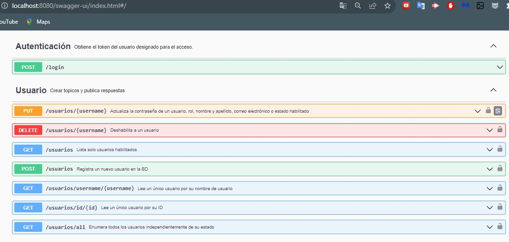
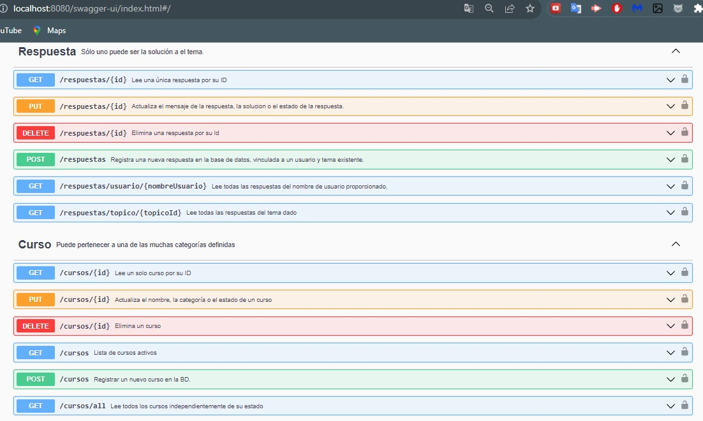
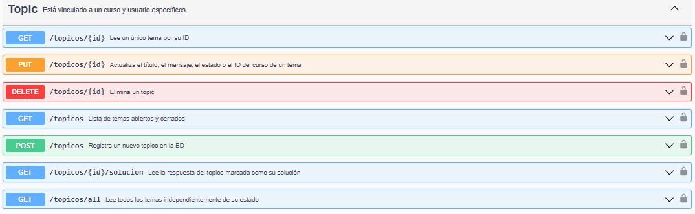
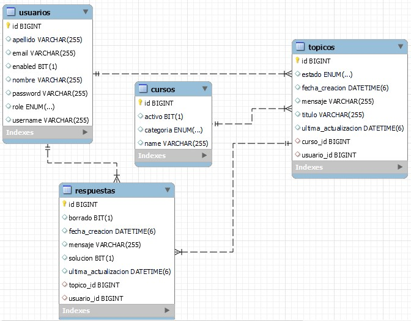

<div align="center">
   <h1>Challenge ONE | Java | Back End - SpringBoot | API REST - Foro Alura</h1>
</div>


<p align="center">
  
  <br>
  
  
</p>

<p align="center" >
     
</p>

👨🏻‍💻 <strong>Gerson Escobedo Pérez </strong></br>
<a href="https://www.linkedin.com/in/gerson-escobedo/" target="_blank">
</a>

## Índice

* [📜 Descripción del proyecto](#descripción-del-proyecto)

* [📝 Estado del proyecto](#estado-del-proyecto)

* [🖥️ Características y demostración del Proyecto](#características-y-demostracion-Proyecto)

* [📖 Acceso al proyecto](#acceso-proyecto)

* [🖥️ Tecnologías utilizadas](#tecnologías-utilizadas)

* [💙 Personas Contribuyentes](#personas-contribuyentes)

* [Licencia](#licencia)

# 📜 Descripción del proyecto
<p>El foro alura es un lugar donde todos los alumnos de la plataforma alura
pueden colocar sus preguntas sobre determinados cursos, este mágico lugar está lleno de mucho aprendizaje y de colaboración entre alumnos, profesores y moderadores.

Ya sabemos para que sirve el foro y sabemos cómo se ve, pero ¿sabemos cómo funciona por detrás? Es decir ¿dónde se almacenan las informaciones? ¿cómo se tratan esos datos para que se relacione un tópico con una respuesta, o como se relacionan los usuarios con las respuestas de un tópico?
Ese es nuestro desafío, vamos a replicar a nivel de back end este proceso, y para eso crearemos una API REST usando Spring.

Nuestra API va a centrarse específicamente en los tópicos, y debe permitir a los usuarios:

Crear un nuevo tópico
Mostrar todos los tópicos creados
Mostrar un tópico específico
Actualizar un tópico
Eliminar un tópico.</p>


### Lo que se solicitó Foro Alura:
1. Sistema de autenticación para el usuario para que pueda gestionar los recursos.
2. Permitir Mostrar todos los datos, mostrar dato especifico, crear, editar y eliminar un Topico, Respuesta, Curso o un Usuario.
3. Base de datos para almacenar todos los datos pedidos anteriormente.


# 📝 Estado del proyecto
<p>
   
</p>

# 🖥️ Características y demostración del Proyecto
### Tablas de la Base de Datos Foro Alura:
- Recomendacion: Crear primero la BD y sus tablas luego codificar en Eclipse o Intellij IDEA.

## Documentacion del proyecto
1. Funcionalidades




* Enlaces TRELLO de referencia:
  * https://trello.com/b/lj8N7Ng9/foro-alura-challenge-one-springboot
* Diseño de la BD: 
  * 
    
### Video del funcionamiento de la aplicacion
[](https://www.youtube.com/watch?v=3ivkN_BYxM8)

# 📖 Acceso al proyecto
### ¿Cómo descargar?
### Pasos principales:
#### ⭐Marca este proyecto con una estrella 

#### 🔹 Fork
1. Haga el **Fork** del proyecto. En la parte superior derecha, al hacer clic en el icono, creará un repositorio del proyecto en su cuenta personal de GitHub.

#### 🔹 Clonar el repositorio

1. Clonar repositorio:

```zsh
git clone https://github.com/Gerson121295/Challenge_Foro_Alura.git
```
2. Ir al directorio del proyecto:

```zsh
cd Challenge_Foro_Alura
```
3. Abrir el proyecto en Intellij IDEA:

```zsh
Listo
```

# 🖥️ Tecnologías utilizadas
- ☕ Java 17
- JPA Hibernate
- [Intellij](https://www.jetbrains.com/idea/)
- [MySql](https://www.mysql.com/)
- [Java](https://www.java.com/en/)

- [Spring Security](https://start.spring.io/)
- [Token JWT](https://jwt.io/)

## ⚠️ Importante! ⚠️
☕ Usar Java versión 8 o superior para compatibilidad. </br></br>
📝 Recomiendo usar el editor de Intellij</br></br>


